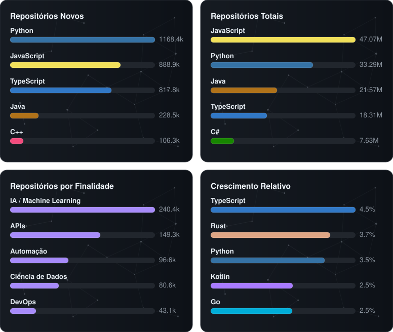

# Orion Index

Rastreia as linguagens de programação mais usadas no mundo, combinando três perspectivas diferentes de propósito, em vez de fingir que existe uma resposta única pra "linguagem mais usada". As três vêm exclusivamente da API GraphQL oficial do GitHub, buscadas ao vivo, sem nenhum número fixo no código, sem depender de nenhum terceiro.



## Por que três perspectivas, e por que elas não concordam

Nenhum ângulo de popularidade de linguagem mede a mesma coisa que os outros, e este projeto assume isso em vez de esconder:

| Perspectiva | O que mede de verdade | Como é calculada |
| --- | --- | --- |
| **GitHub — Repositórios Totais** | Quantidade de repositórios públicos **já existentes** por linguagem principal — o acumulado histórico, tamanho do ecossistema | `language:X` |
| **GitHub — Repositórios Novos** | Quantidade de repositórios **criados** nos últimos 30 dias por linguagem — volume absoluto do que está sendo adotado agora | `language:X created:>DATA` |
| **GitHub — Crescimento Relativo** | **Novos ÷ Totais**, em % — não é uma busca nova, é a razão entre as duas de cima. Mede velocidade de crescimento **relativa ao próprio tamanho** | derivado, sem chamada extra à API |

Todas partem da mesma API GraphQL oficial do GitHub (`search(query: "language:X", type: REPOSITORY)`). Repositórios Totais mede o que já existe (acumulado de anos) — favorece linguagem grande e estabelecida. Repositórios Novos mede criação de projeto do zero em número absoluto (janela de 30 dias) — também favorece linguagem já grande, porque tem mais gente usando. Crescimento Relativo neutraliza esse viés de tamanho: linguagem pequena mas em expansão rápida (ex: Rust, Dart) pode aparecer na frente de uma gigante estabelecida que cresce bastante em número absoluto mas pouco proporcionalmente. Por isso os top 5 de cada uma são diferentes entre si, e isso é o esperado, não um erro.

### Por que não usamos PYPL

O [PYPL](https://pypl.github.io/PYPL.html) (interesse de busca por "[linguagem] tutorial" via Google Trends) é dado real, aberto (CC-BY) e é a referência mais estabelecida pra esse ângulo específico há mais de uma década — mas é um projeto pessoal de terceiro, sem contrato de acesso ou API oficial por trás. Preferimos manter as três perspectivas 100% dentro da API oficial do GitHub, sem depender de mais ninguém no meio.

### Por que não usamos mais a Stack Overflow Developer Survey

Chegamos a usar o CSV oficial da pesquisa (dado real, publicado pela própria Stack Exchange). Trocamos pela terceira perspectiva do GitHub (Crescimento Relativo) pra ficar 100% dentro de uma única fonte, com uma única API, um único token de acesso e um único modelo de confiança — em vez de misturar busca ao vivo com CSV anual de outra organização. Menos peça em movimento, mais fácil de auditar.

### Por que Crescimento Relativo, e não "repositórios com push recente"

A primeira versão da terceira perspectiva era "repositórios que receberam push nos últimos 30 dias" (`pushed:>DATA`) — mas na prática o top 5 saía quase idêntico ao de Repositórios Novos, porque as duas métricas em número absoluto são dominadas pelas mesmas linguagens gigantes (Python, JavaScript, TypeScript, Java). Trocamos por uma razão (Novos ÷ Totais) porque isso normaliza pelo tamanho de cada linguagem e produz um ranking genuinamente diferente, revelando quem está crescendo rápido de verdade — não só quem já é grande.

### Por que não usamos o relatório Octoverse do GitHub

O [GitHub Octoverse](https://github.blog/news-insights/octoverse/) mede contribuidores mensais distintos — métrica interessante, mas é só um relatório esporádico em prosa, sem API nem dataset estruturado por trás (testamos: nem `octoverse.github.com` nem os posts do blog têm qualquer endpoint de dado). Sem forma de automatizar de verdade, preferimos usar a própria API de busca do GitHub, que dá pra consultar ao vivo.

### Por que o TIOBE Index não está aqui

O [TIOBE Index](https://www.tiobe.com/tiobe-index/) é citado com frequência ao lado desses outros, mas foi excluído de propósito: o [termo de uso deles](https://www.tiobe.com/disclaimer/) proíbe explicitamente copiar, reproduzir ou publicar o conteúdo sem consentimento prévio, e eles vendem o dataset histórico completo como produto pago (US$ 5.000). Raspar e republicar esse dado violaria o próprio termo deles e contornaria um produto que é vendido comercialmente.

### HTML/CSS não entram

Nenhuma das três perspectivas conta HTML ou CSS no gráfico: marcação e estilo não são linguagem de programação (não têm lógica, controle de fluxo, etc.), mesmo quando a busca original os inclui na lista.

## Como funciona

[`scripts/generate.py`](scripts/generate.py) roda mensalmente (e sob demanda) via GitHub Actions, sem nenhuma dependência externa além da biblioteca padrão do Python e o `GITHUB_TOKEN` automático do Actions:

1. Consulta a API GraphQL do GitHub (`search(query: "language:X", type: REPOSITORY)`) pra cada linguagem candidata e pega a contagem total de repositórios (repositórios totais).
2. Repete a mesma consulta com `created:>DATA` (últimos 30 dias) pra medir o que está sendo criado agora (repositórios novos).
3. Divide novos ÷ totais por linguagem (crescimento relativo) — sem chamada extra à API.
4. Gera um card SVG por perspectiva (`docs/github_total.svg`, `docs/github_new.svg`, `docs/github_growth.svg`) e um combinado (`docs/orion-index.svg`).
5. Commita os arquivos gerados se algo mudou.

Nenhuma das três perspectivas precisa de ação manual — tudo é buscado do zero a cada execução, sempre com o dado mais recente disponível.

## Usando em outro lugar

Qualquer repositório público pode embutir o card combinado direto, sem precisar rodar nada:

```markdown

```

Ou só um dos três painéis individuais (`docs/github_total.svg`, `docs/github_new.svg`, `docs/github_growth.svg`), no mesmo formato de URL.

---

> Documentação e código gerados com auxílio de IA.
